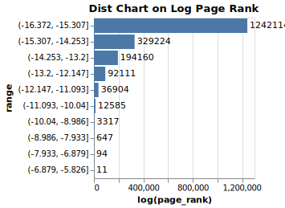
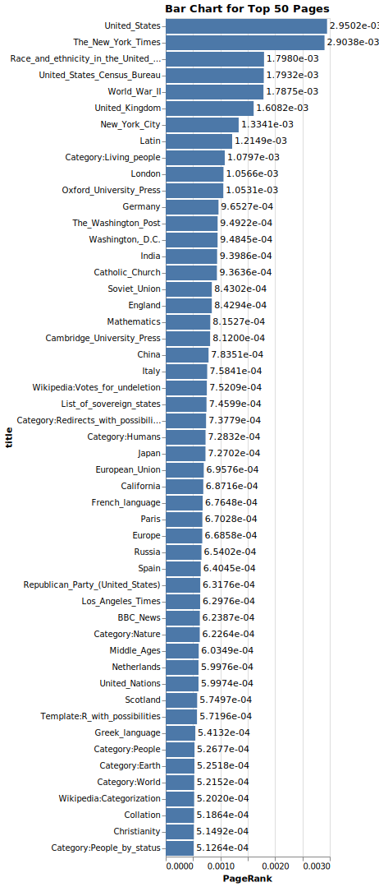
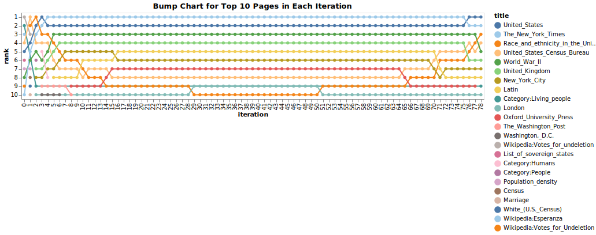

# PageRank 报告

王奕轩 1900014136

## 代码

```
pyproject.toml
poetry.lock

parse.py
indexing.py
sparse.py
rank.py

result.csv
```

代码使用 Poetry 进行依赖管理，配置和 Lockfile 分别位于 `pyproject.toml` 和 `poetry.lock`。Python 版本 3.9+（在 3.10 上测试）。

### `parse.py`

`parse.py` 从环境变量 `DATA_DIR` 中读取，并以 XML 文件为单位处理数据。通过 `lxml` 提供的 incremental parsing，可以不将整个 XML 文件全部读入内存，而是按行读取直到解析出一个完整的 `<page>` 元素，也就是一个 Wiki 页面，先提取出 `<title>` 元素中记录的当前页面的标题，再用 MediaWiki 解析器处理，获得所有的 WikiLinks。WikiLinks 的格式是 `[[title|text]]`，从中提取 `title` 部分，并去除用于页面内部导航的 Anchor 部分，可以获得该 WikiLink 指向的页面的标题。对于所有的标题，统一处理为形如 `This_is_an_example_(some_explanation)` 的 Wikipedia 实际使用的大小写样式，也就是第一个字母强制大写的 Snake Case。处理结果最终按照有向图中 `(source_node, target_node)` 元组的格式存入一个 Arrow 表，并写入磁盘上位于 `data/wikipedia-links` 的 Parquet 表。这一部分由于没有采取并行处理，速度较慢，完整处理全部页面需要大约 9h。

### `indexing.py`

`indexing.py` 读入 `data/wikipedia-links` Parquet 表，并提取出其中的 `title` 列转换为内存中的 Arrow 表，提取出所有的页面标题，排序并赋予一个 `int64` 范围内的非负编号，并构建从 `title` 到编号的哈希表，并将该哈希表存入 `title.pickle`，同时分块读取 Parquet 表入内存，并将页面和链接全部转换为编号，存入 `data/wikipedia-links-index` Parquet 表。如果链接到的页面并不存在于数据集中（没有出现在任何标题中），则赋予 -1。

### `sparse.py`

`sparse.py` 读入 `data/wikipedia-links-index` Parquet 表，选取其中链接编号非 -1 的，作为坐标写入一个 `scipy.sparse.coo_array` 稀疏矩阵，行为页面，列为链接。最终将各个分块的矩阵累加，存储在 `sparse.pickle`。稀疏矩阵的形状是 $(1911167, 1911167)$。

## PageRank 实现

实现位于 `rank.py`. 首先读取 `sparse.pickle` 中的 COO 稀疏邻接矩阵 $A$，按行进行归一化（使得每行和为 1）得到转移概率矩阵 $P$.

采用基于矩阵以及 Random Walk with Restart 的 PageRank 算法. 取阻尼系数(damping factor) $\alpha = 0.85$, 考虑到精度原因, PageRank 向量 $\pi$ 全部用 1 初始化.
$$
\pi \leftarrow \alpha P^\top\pi + (1-\alpha) \frac{1}{n}e
$$
按上式迭代计算, 直到达到预设的迭代上限 100 或是 $\|\Delta\pi\|_1 < ln$ 时视作收敛, 其中 $l = 1.0 \times 10^{-7}$.

## 结果

在以上实现下, 最终迭代 78 次后收敛. 对 PageRank 值取对数统计其分布区间,得到下图:



可以看出, 由于 Wikipedia 关系图的极度稀疏, 大部分的页面的 PageRank 值都非常接近 0, 且趋向于 0 时页面的数量显著增多, 其中有 677653 个页面并列 PageRank 倒数第一. 通过简单引入 Random Restart, 缓解了 Rank Leak 的问题 (虽然 Wikipedia 的每一个页面几乎都至少有一个链接——一个极端的例子是重定向页面, 如果忽略数据集不完整的情况, 但考虑到不同页面的出度可以相差甚远, 也会造成近似于 Leak 的现象).

对于最终得到的 PageRank, 取排名前 50 的页面, 得到下图:



最终绝对 PageRank 值比较高的大多是政治实体(United States, New York City)和其他政治及历史相关词汇(World War II), 新闻出版(The New York Times, Oxford University Press), 语言(Latin, Greek language), 宗教(Catholic Church). 排名比较高的抽象概念名词有 Mathematics, 以及非常短小且冷僻的 Collation. 此外,有一部分集合页面(Category:Living People, List of sovereign states)和 Wikipedia 的技术性页面(Template:R with possibilities, Wikipedia:Categorization)也排名较为靠前. 似乎和美国相关的事物排名都会有绝对值上较高的的 PageRank 值, 这可能是由于英语 Wikipedia 中美国相关的知识信息比较完整, 而其他国家的知识信息则相对欠缺, 在 PageRank 的迭代过程中, 美国相关知识之间分发 Rank 更多, 更加凸显了这种结构性的差异. 这对于搜索引擎来说是一个比较严重的问题. 比如, 检索 "president" 时, PageRank 值排在前 3 名的是 President of the United States 和 Vice President of the United States 以及 Presidential System, 其后才是 President of France, 这种先验的 bias 会极大地影响搜索的体验, 可能这也是 Google 在搜索时会尝试结合定位信息和其他收集到的个人信息来试图改善搜索结果.

为了考察迭代的情况, 我们记录每一次迭代中 PageRank 绝对值前十的页面, 绘制如下的 bump chart:




可以发现, 最终收敛时排名前 10 的页面在 5 - 6 次迭代后基本上已经稳定排在前 10 的位置了, 基本只是顺序有所微调. 值得注意的是, Race and Ethnicity in the United States 这一页面的 PageRank 排名先降后升, 表现得比较不稳定. 一种推测是, 由于美国民族成分非常多元复杂, 而指向它的页面的 Rank 并不高, 导致这一页面的 Rank 先期被大量分发到其他国家地区的页面, 而随着迭代进行, 与国家地区无关的页面的 Rank 下滑更快, 最终导致该页面排名相对靠前. 但无法解释为何该页面在最开始时 Rank 较高.

此外, 在实际的搜索过程中, PageRank 在一系列关键词中的相对排名更为重要. 对于一些与政治无关的名词, 比如 "web" 的搜索结果, 排在第一位的是 World Wide Web(1.5795e-04, 499), 第二位是 Web browser(1.1267e-04, 899), 比较切合搜索的主题. 但搜索 "communism|communist" 的时候, 排在第一位的是 Chinese Communist Party(1.2555e-04, 742), 第二位是 Communist Party of the Soviet Union(7.9822e-05, 1588), 第三位才是 Communist(5.2463e-05, 3102). 这表明, PageRank 引入的 bias 可能会在搜索结果中添加额外且不必要的信息, 这证明在搜索中完全依赖仅考虑拓扑关系的 PageRank 是不够的.